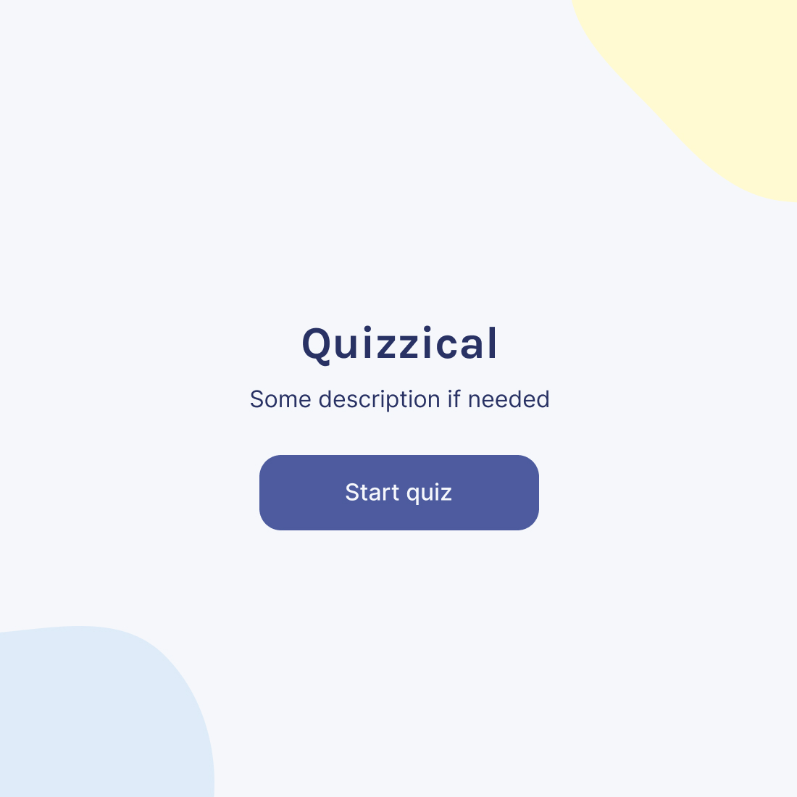
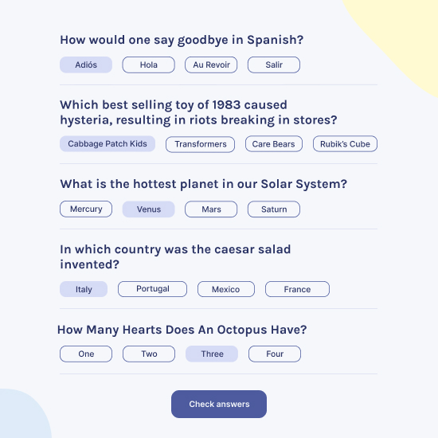
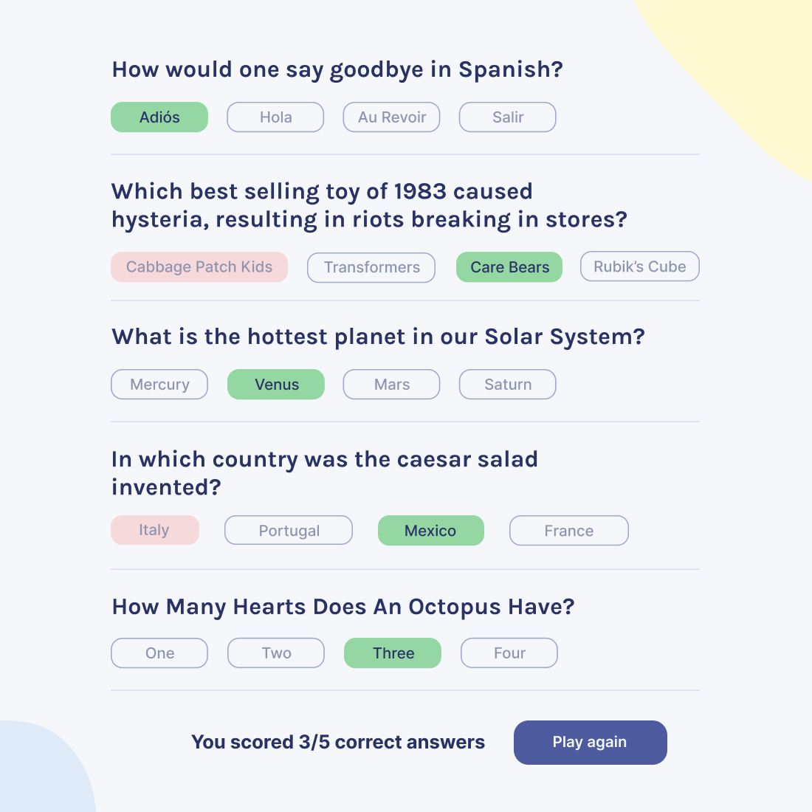

# Quiz App
The simple React App on TypeScript with using useContext and useReducer. I used some different React-libraries as Select, Spinners and Styled-components for stylization. Also I touched Buffer for decoding a data response from base64.

[Watch demo](https://evgenywas.github.io/finance-logger/)

> Start page preview

> Questions on quiz page preview

> Answers on quiz page preview

### Summary
Brought [Bob Ziroll](https://github.com/bobziroll) design to life, trained basic hooks as useContext and useReducer and improved work with network requestests and promises.